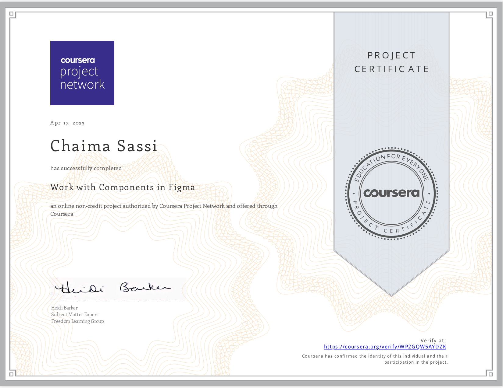
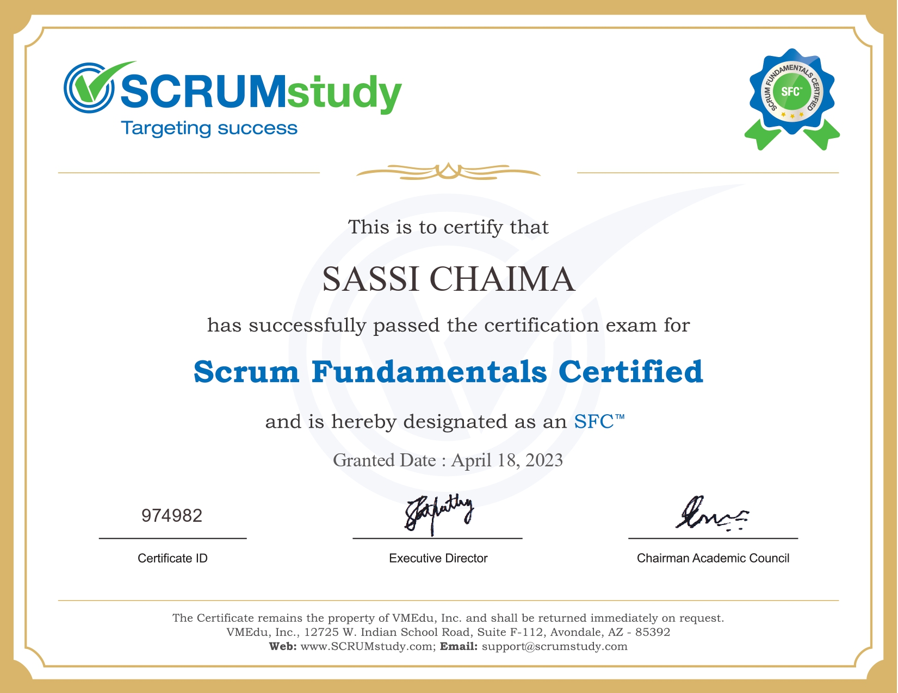

<!-- Updating my readme for GitHub-->

<h1 align="center" style="color: black" >Hi , I'm CHAIMA SASSI!</h1>

<!-- Typing SVG by DenverCoder1 - https://github.com/DenverCoder1/readme-typing-svg -->

<!--   <a href="https://github.com/DenverCoder1/readme-typing-svg"> -->
    </a>

<h4 align="center" style="color: black">Empowering your digital vision with my web development skills. Browse through my portfolio and experience the magic of my work! If you're seeking assistance in building a product, feature, or website, reach out to me without hesitation. Together, let's transform your ideas into reality!<h4/>
<!-- Social icons section -->

&#8287;&#8287;&#8287;
 
&#8287;&#8287;&#8287;

&#8287;&#8287;&#8287;

 
    
 ---
### About Me 🚀  
    
 
	
- 🎓 I have a **Engineer's degree** in Computer Science & Software Engineering. Obtained from the Iteam University, Tunisia.

- 🌱 I’m looking to collaborate on JavaScript, React , NodeJs , ExpressJS.

- 💻 All **my projects** are available [here.](https://github.com/chaima-sassi-webdev?tab=repositories)
  
### 🚀 Check out [my portfolio.]()
---
<h2 align="left"> Languages and Tools :hammer_and_wrench:
</h2>

	
	
	
	
	
	
	
	
	
	
	 
   
	
	
	 
	 

---

<h2 align="left">Certificates & Licenses 🥇</h2>

  &nbsp; &nbsp; &nbsp; &nbsp;  &nbsp;   &nbsp;   &nbsp;   &nbsp;  

